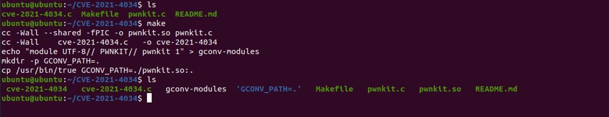
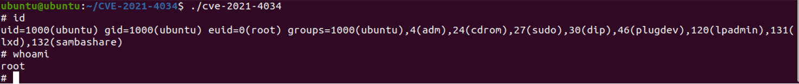

### Information

```
Exploit Title: Local Privilege Escalation in polkit's pkexec (CVE-2021-4034)
Date: 01/25/2022
Exploit Author: Qualys Research Team
Tested on: ubuntu 20.04.1 LTS
CVE ID: CVE-2021-27928
```

## How to Exploit
Test Environment：


Step 1：build the exp(From https://github.com/berdav/CVE-2021-4034)

```
make
```



Step 2：run exploit and get a root shell



### Analysis Detail

https://blog.qualys.com/vulnerabilities-threat-research/2022/01/25/pwnkit-local-privilege-escalation-vulnerability-discovered-in-polkits-pkexec-cve-2021-4034

### Reference

https://github.com/berdav/CVE-2021-4034

https://www.qualys.com/2022/01/25/cve-2021-4034/pwnkit.txt

### Disclosure Timeline

- 2021-11-18: Advisory sent to secalert@redhat.
- 2022-01-11: Advisory and patch sent to distros@openwall.
- 2022-01-25: Coordinated Release Date (5:00 PM UTC).
