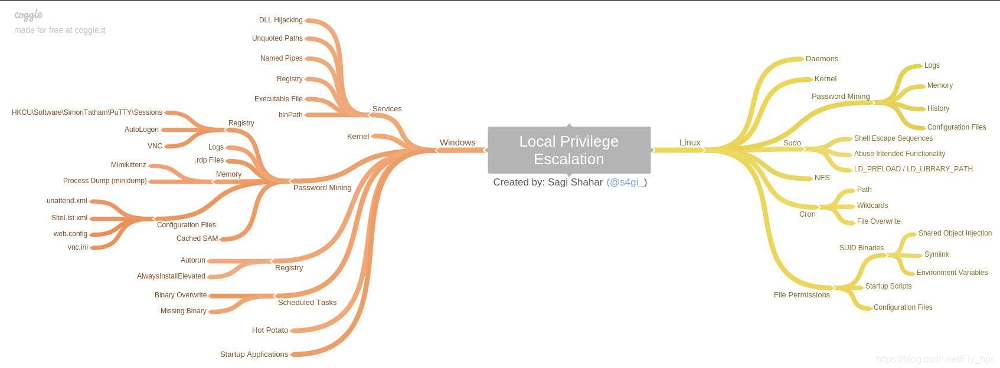

## What's this

This project is mainly used to collect the exp for Linux platform privilege promotion, only to help penetration testers quickly achieve privilege promotion in actual combat

## Information

| CVE ID                                 | Description   |                           Kernels                            |
| -------------------------------------- | ------------- | :----------------------------------------------------------: |
| [CVE-2004-0077](./CVE-2004-0077)       | Linux Kernel  |            2.4.20, 2.2.24, 2.4.25, 2.4.26, 2.4.27            |
| [CVE-2004-1235](./CVE-2004-1235)       | Linux Kernel  |                            2.4.29                            |
| [CVE-2005-0736](./CVE-2005-0736)       | Linux Kernel  |          2.6.5, 2.6.7, 2.6.8, 2.6.9, 2.6.10, 2.6.11          |
| [CVE-2005-1263](./CVE-2005-1263)       | Linux Kernel  | 2.x.x to 2.2.27-rc2, 2.4.x to 2.4.31-pre1, and 2.6.x to 2.6.12-rc4 |
| [CVE-2006-2451](./CVE-2006-2451)       | Linux Kernel  |            2.6.13, 2.6.14, 2.6.15, 2.6.16, 2.6.17            |
| [CVE-2006-3626](./CVE-2006-3626)       | Linux Kernel  | 2.6.8, 2.6.10, 2.6.11, 2.6.12, 2.6.13, 2.6.14, 2.6.15, 2.6.16 |
| [CVE-2008-0600](./CVE-2008-0600)       | Linux Kernel  |                        2.6.23, 2.6.24                        |
| [CVE-2008-0900](./CVE-2008-0900)       | Linux Kernel  |                       2.6.17~2.6.24.1                        |
| [CVE-2008-4210](./CVE-2008-4210)       | Linux Kernel  |                        2.6.11~2.6.22                         |
| [CVE-2009-1185](./CVE-2009-1185)       | Linux Kernel  |            2.6.25, 2.6.26, 2.6.27, 2.6.28, 2.6.29            |
| [CVE-2009-1337](./CVE-2009-1337)       | Linux Kernel  |                        CVE-2009-1337                         |
| [CVE-2009-2692](./CVE-2009-2692)       | Linux Kernel  |                  2.4.4-2.4.37，2.6.0~2.6.30                  |
| [CVE-2009-2698](./CVE-2009-2698)       | Linux Kernel  |                         2.6.1~2.6.19                         |
| [CVE-2009-3547](./CVE-2009-3547)       | Linux Kernel  |                 2.4.4-2.4.37,2.6.15-2.6.31                  |
| [CVE-2010-1146](./CVE-2010-1146)       | Linux Kernel  |                        2.6.18~2.6.34                         |
| [CVE-2010-2959](./CVE-2010-2959)       | Linux Kernel  |                        2.6.18~2.6.36                         |
| [CVE-2010-3081](./CVE-2010-3081)       | Linux Kernel  |                         2.6.0~2.6.33                         |
| [CVE-2010-3301](./CVE-2010-3301)       | Linux Kernel  |                        2.6.26~2.6.34                         |
| [CVE-2010-3437](./CVE-2010-3437)       | Linux Kernel  |                         2.6.0~2.6.36                         |
| [CVE-2010-3904](./CVE-2010-3904)       | Linux Kernel  |                        2.6.30~2.6.36                         |
| [CVE-2010-4073](./CVE-2010-4073)       | Linux Kernel  |                         2.6.0~2.6.36                         |
| [CVE-2010-4258](./CVE-2010-4258)       | Linux Kernel  |                        2.6.31~2.6.37                         |
| [CVE-2010-4347](./CVE-2010-4347)       | Linux Kernel  |                         2.6.0~2.6.36                         |
| [CVE-2012-0056](./CVE-2012-0056)       | Linux Kernel  | 2.6.39, 3.0.0, 3.0.1, 3.0.2, 3.0.3, 3.0.4, 3.0.5, 3.0.6, 3.1.0 |
| [CVE-2012-3524](./CVE-2012-3524)       | libdbus       |                      1.5.x and earlier                       |
| [CVE-2013-0268](./CVE-2013-0268)       | Linux Kernel  | 2.6.18-2.6.39，3.0.0-3.0.6，3.1.0, 3.2, 3.3, 3.4, 3.5, 3.6, 3.7.0, 3.7.6 |
| [CVE-2013-1763](./CVE-2013-1763)       | Linux Kernel  |                           3.3-3.8                            |
| [CVE-2013-1858](./CVE-2013-1858)       | Linux Kernel  |                            <3.8.3                            |
| [CVE-2013-2094](./CVE-2013-2094)       | Linux Kernel  | 3.0.0-3.0.6，3.1.0, 3.2, 3.3, 3.4.0-3.4.9,3.5, 3.6, 3.7, 3.8.0-3.8.9 |
| [CVE-2014-0038](./CVE-2014-0038)       | Linux Kernel  | 3.4-3.13,3.4.0-3.8.0，3.8.5，3.8.6, 3.8.9, 3.9.0, 3.9.6, 3.10.0-3.13.0, |
| [CVE-2014-0196](./CVE-2014-0196)       | Linux Kernel  |                  2.6.31~ 2.6.39, 3.14, 3.15                  |
| [CVE-2014-3153](./CVE-2014-3153)       | Linux Kernel  | 3.3.2-3.3.5,3.0.1-3.0.5,2.6.32-2.6.39,2.6.4-2.6.9,3.2.2 ,3.0.18 |
| [CVE-2014-4014](./CVE-2014-4014)       | Linux Kernel  |                        before 3.14.8                         |
| [CVE-2014-4699](./CVE-2014-4699)       | Linux Kernel  |                        before 3.15.4                         |
| [CVE-2014-5284](./CVE-2014-5284)       | File Creation |                       OSSEC OSSEC 2.8                        |
| [CVE-2015-1328](./CVE-2015-1328)       | Linux Kernel  |                     3.13, 3.16.0, 3.19.0                     |
| [CVE-2015-8550](./CVE-2015-8550)       | Linux Kernel  |                             Linux-4.19.65                    |
| [CVE-2015-7547](./CVE-2015-7547)       | Glibc         |                       before Glibc 2.9                       |
| [CVE-2016-0728](./CVE-2016-0728)       | Linux Kernel  | 3.8.0-3.8.9,3.9-3.13,3.4.0-3.13.0,3.8.5-3.8.9,3.10.6,3.9.6,3.13.1 |
| [CVE-2016-2384](./CVE-2016-2384)       | Linux Kernel  |                          before 4.5                          |
| [CVE-2016-5195](./CVE-2016-5195)       | Linux Kernel  |                        kernel>2.6.22                         |
| [CVE-2016-9793](./CVE-2016-9793)       | Linux Kernel  |                        before 4.8.14                         |
| [CVE-2017-5123](./CVE-2017-5123)       | Linux Kernel  |                      Kernel 4.14.0-rc4+                      |
| [CVE-2017-8890](./CVE-2017-8890)       | Linux Kernel  |                        Linux-4.10.15                         |
| [CVE-2017-11176](./CVE-2017-11176)     | Linux Kernel  |                        Linux-4.11.9                          |
| [CVE-2017-6074](./CVE-2017-6074)       | Linux Kernel  |                 Linux kernel through 4.9.11                  |
| [CVE-2017-7308](./CVE-2017-7308)       | Linux Kernel  |                 Linux kernel through 4.10.6                  |
| [CVE-2017-7494](./CVE-2017-7494)       | Samba         |               Samba 3.5.0-4.6.4/4.5.10/4.4.14                |
| [CVE-2017-16939](./CVE-2017-16939)     | Linux Kernel  |                 Linux kernel before 4.13.11                  |
| [CVE-2017-16995 ](./CVE-2017-16995)    | Linux Kernel  |                Linux Kernel Version 4.14-4.4                 |
| [CVE-2017-1000367](./CVE-2017-1000367) | Sudo          |                    Sudo 1.8.6p7 - 1.8.20                     |
| [CVE-2018-5333](./CVE-2018-5333)       | Linux Kernel  |                         Linux-4.14.13                        |
| [CVE-2018-17182](./CVE-2018-17182)     | Linux Kernel  |                         3.16-4.18.8                          |
| [CVE-2018-18955](./CVE-2018-18955)     | Linux Kernel  |       Linux kernel 4.15.x through 4.19.x before 4.19.2       |
| [CVE-2018-1000001](./CVE-2018-1000001) | glibc         |                          glibc 2.26                          |
| [CVE-2019-7304](./CVE-2019-7304)       | snapd         |                        snapd < 2.37.1                        |
| [CVE-2019-2215](./CVE-2019-2215)       | Linux Kernel  |                               binder.c                       |
| [CVE-2019-15666](./CVE-2019-15666)     | Linux Kernel  |                           Linux-4.14.13                      |
| [CVE-2019-13272](./CVE-2019-13272)     | Linux Kernel  |                     Linux 4.10 < 5.1.17                      |
| [CVE-2020-8835](./CVE-2020-8835)       | Linux Kernel  |                           Linux-5.5.0                        |
| [CVE-2020-27194](./CVE-2020-27194)     |Linux Kernel    |                     Linux-5.8.14                            |
| [CVE-2021-3156](./CVE-2021-3156)       | sudo          |                     Sudo before 1.9.5p2                      |
| [CVE-2021-3493](./CVE-2021-3493)       |Ubuntu OverLayFS|    Ubuntu 14 04 ESM 16 04 LTS 18 04 LTS 20 04 LTS           |
| [CVE-2021-4034](./CVE-2021-4034)       |pkexec          |    All Linux *                                              |
| [CVE-2021-3490](./CVE-2021-3490)       | Linux Kernel   |              Linux-5.11 Linux-5.11.16                       |
| [CVE-2021-22555](./CVE-2021-22555)     | Linux Kernel   |              Linux-5.11.14                                  |
| [CVE-2021-31440](./CVE-2021-31440)     | Linux Kernel   |               Linux-5.11                                    |
| [CVE-2021-42008](./CVE-2021-42008)     | Linux Kernel   |               Linux-5.13.12                                 |
| [CVE-2021-43267](./CVE-2021-43267)     | Linux Kernel   |               Linux-5.14.15                                 |
| [CVE-2022-0847](./CVE-2022-0847)       | Linux Kernel   |               Linux kernel <5.17-rc6                        |

## Mind Map

## Tools、\16 04 LTS、

- [Linux_Exploit_Suggester](https://github.com/PenturaLabs/Linux_Exploit_Suggester)　[@PenturaLabs](https://github.com/PenturaLabs/Linux_Exploit_Suggester)  
- [mzet-/linux-exploit-suggester](https://github.com/mzet-/linux-exploit-suggester)  
- [jondonas/linux-exploit-suggester-2](https://github.com/jondonas/linux-exploit-suggester-2/blob/master/linux-exploit-suggester-2.pl)  
- [spencerdodd/kernelpop](https://github.com/spencerdodd/kernelpop)
- [SUDO_KILLER](https://github.com/TH3xACE/SUDO_KILLER)

## Operators

+ **Al1ex**(<a href="https://github.com/Al1ex">@Al1ex</a>) 

## Disclaimer

Please do not use it for illegal purposes, or you will be responsible for the serious consequences.

## Reference

- [Unix-Privilege-Escalation-Exploits-Pack](https://github.com/Kabot/Unix-Privilege-Escalation-Exploits-Pack/)
- [A bunch of proof-of-concept exploits for the Linux kernel](https://github.com/xairy/kernel-exploits)  
- [kernel-exploits](https://github.com/lucyoa/kernel-exploits)
- [linux-kernel-exploits](https://github.com/SecWiki/linux-kernel-exploits)
- [kernel-exploit-factory](https://github.com/bsauce/kernel-exploit-factory)

